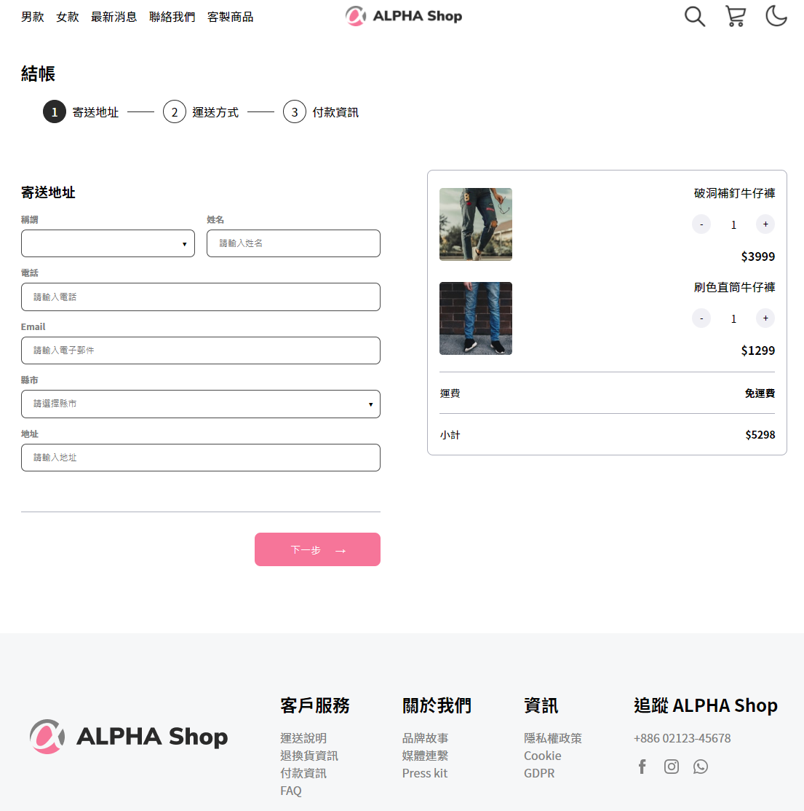

# alphacart-vue

透過 vue.js 打造，購物車流程表單

## 預覽圖

)

## 功能介紹

- 購物車結帳，填單流程三階段：寄送地址、運送方式、付款資訊
- 使用者選擇的商品數量、運費，皆會即時反應在小計上
- 畫面 RWD 優化

## Project setup

```
npm install
```

### Compiles and hot-reloads for development

```
npm run serve
```

### Compiles and minifies for production

```
npm run build
```

### Lints and fixes files

```
npm run lint
```

### Customize configuration

See [Configuration Reference](https://cli.vuejs.org/config/).
